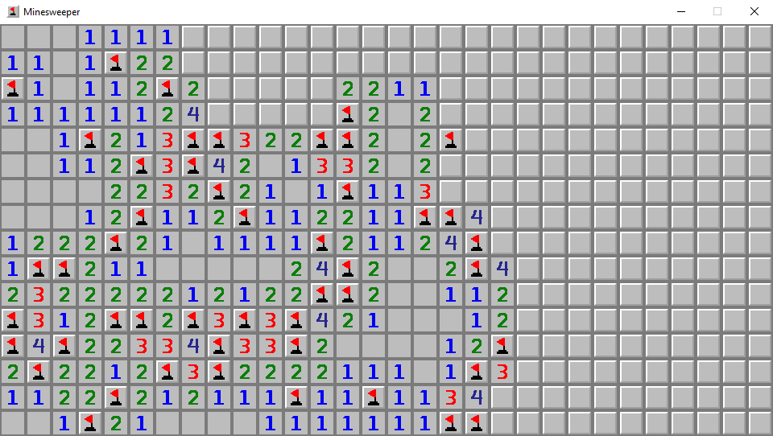

# minesweeper

Welcome to my minesweeper repository. This project was programmed in python using the `pygame` library. Feel free to use this repositories contents however you see fit.

## Features
- Quick performance
- Custom tile art inspired by [minesweeperonline.com](https://minesweeperonline.com)
- Place flags using both `RMB` and `Spacebar`
- Preset difficulty list
    - Beginner `9 x 9 w/ 10 mines`
    - Intermediate `16 x 16 w/ 40 mines`
    - Expert `30 x 16 w/ 99 mines`
- Custom board creation