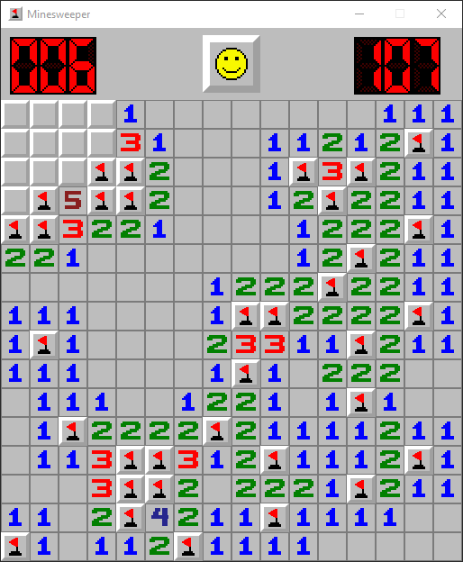

# minesweeper

Welcome to my minesweeper repository! This project was programmed in python using the [pygame](https://www.pygame.org/docs/) library. Feel free to use this repository's contents however you see fit.



## Features
- Realtime performance
- Custom tile art heavily-inspired by [minesweeperonline.com](https://minesweeperonline.com)
- Place flags using both `RMB` and `Spacebar`
- Preset difficulty list
    - Beginner `9 x 9 w/ 10 mines`
    - Intermediate `16 x 16 w/ 40 mines`
    - Expert `30 x 16 w/ 99 mines`
- Build custom game boards

## Installation Guide
1. Clone the repository:
```
git clone https://github.com/green4ja/minesweeper.git
```
2. Run the `game.py` file.